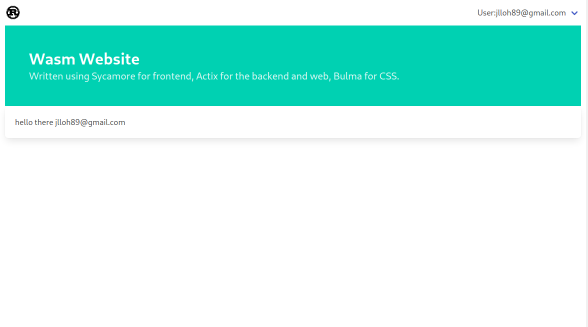
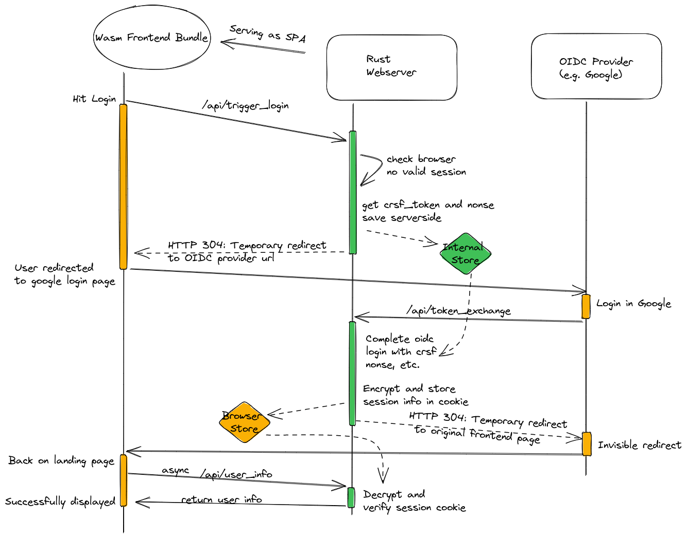

## Introduction
Example full stack Rust project, using actix-web and Sycamore and bulma-css. (Initially was using dioxus but switched to sycamore to test out the api)

Adapted from https://robert.kra.hn/posts/2022-04-03_rust-web-wasm/.

Attempts to implement BFF (backend for frontend) pattern for login using oidc. Inspired by Duendesoftware's implementation.



### Architecture
Rough architecture


### Features
- [x] AuthN with Google OIDC, utilising the BFF architecture
- [ ] AuthZ: Access control with something like casbin-rs
- [x] Full stack frontend and backend, with shared structs in `commons`
- [x] Demo of Server Sent Events as a ticker to frontend
- [x] Use Bulma CSS and Sycamore-rs for frontend
- [ ] Integration with a simple database like SQLITE

### Prerequisites
1. Set up google oidc client at https://console.cloud.google.com/apis/credentials
2. Get GOOGLE_CLIENT_ID and GOOGLE_CLIENT_SECRET and set them as environment variables before you run the server binary
3. Set an environment variable SERVER_SECRET_KEY to a random string with at least 64 characters for cryptographically signing your tokens. Keep this a secret.
4. Make sure to set authorised redirect uri to http://localhost:8080/api/token_exchange in your google oauth app

### Instructions
1. Build frontend distribution using Trunk
```bash
cd frontend
trunk build --release
```
2. This will build the wasm bundle in the root ./dist folder
3. Next, compile the backend from the root folder
```bash
cargo build --release
```
4. Run the binary
```
RUST_LOG=INFO target/release/server
```
5. Open your browser at localhost:8080

### When developing
You can watch your front end code with `trunk watch` and start the webserver to serve the frontend 

Note that you'll need to reload the page to see your changes